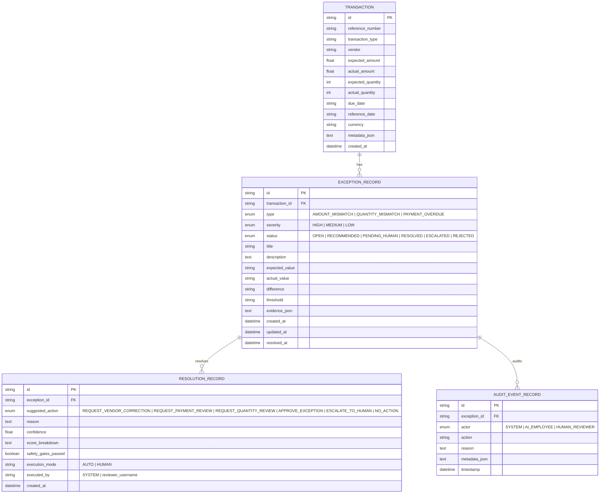

# Data Model & Schema Specification

## Relational Entity-Relationship Diagram

```mermaid
erDiagram
    TRANSACTION ||--o{ EXCEPTION_RECORD : "has"
    EXCEPTION_RECORD ||--o{ RESOLUTION_RECORD : "resolves"
    EXCEPTION_RECORD ||--o{ AUDIT_EVENT_RECORD : "audits"

    TRANSACTION {
        string id PK
        string reference_number
        string transaction_type
        string vendor
        float expected_amount
        float actual_amount
        int expected_quantity
        int actual_quantity
        string due_date
        string reference_date
        string currency
        text metadata_json
        datetime created_at
    }

    EXCEPTION_RECORD {
        string id PK
        string transaction_id FK
        enum type "AMOUNT_MISMATCH | QUANTITY_MISMATCH | PAYMENT_OVERDUE"
        enum severity "HIGH | MEDIUM | LOW"
        enum status "OPEN | RECOMMENDED | PENDING_HUMAN | RESOLVED | ESCALATED | REJECTED"
        string title
        text description
        string expected_value
        string actual_value
        string difference
        string threshold
        text evidence_json
        datetime created_at
        datetime updated_at
        datetime resolved_at
    }

    RESOLUTION_RECORD {
        string id PK
        string exception_id FK
        enum suggested_action "REQUEST_VENDOR_CORRECTION | REQUEST_PAYMENT_REVIEW | REQUEST_QUANTITY_REVIEW | APPROVE_EXCEPTION | ESCALATE_TO_HUMAN | NO_ACTION"
        text reason
        float confidence
        text score_breakdown
        boolean safety_gates_passed
        string execution_mode "AUTO | HUMAN"
        string executed_by "SYSTEM | reviewer_username"
        datetime created_at
    }

    AUDIT_EVENT_RECORD {
        string id PK
        string exception_id FK
        enum actor "SYSTEM | AI_EMPLOYEE | HUMAN_REVIEWER"
        string action
        text reason
        text metadata_json
        datetime timestamp
    }
```
