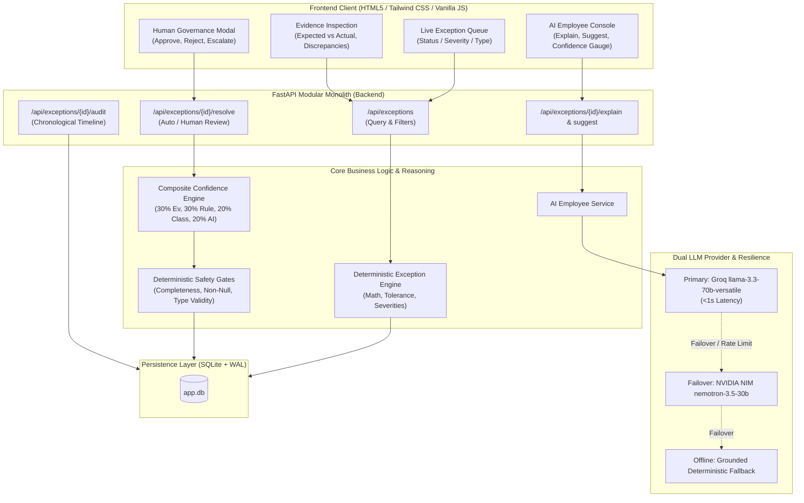

# System Architecture: Real-Time Exception Resolution Workbench

## Overview
The **Exception Resolution Workbench** is a high-performance modular monolith built for AP/Procurement operations. It marries **deterministic exception detection** (for zero-hallucination mathematical verification) with **evidence-grounded AI employees** and a strict **human-in-command governance loop**.

## Key Architectural Decisions

1. **Deterministic-First Discrepancy Math**: Discrepancies (e.g. 25% price variance, short shipment of 80 units, 17 days past due) are calculated with 100% determinism.
2. **Dual-Tier Resilient AI Pipeline**: Groq (`llama-3.3-70b-versatile`) delivers sub-second inference. If rate limits (HTTP 429) or connection issues occur, requests transparently fail over to NVIDIA NIM (`nemotron-3.5-lightning-30b-a3b`), and finally to offline deterministic rule synthesis.
3. **Composite Confidence Scoring Formula**:
   $$	ext{Confidence} = 0.30 	imes 	ext{evidence\_score} + 0.30 	imes 	ext{rule\_certainty} + 0.20 	imes 	ext{classification\_score} + 0.20 	imes 	ext{ai\_score}$$
4. **Deterministic Safety Gates**:
   - Evidence completeness score $\ge 0.70$
   - All mandatory fields non-null
   - Resolvable exception type
5. **Human-in-Command Autonomous Thresholds**:
   - $\ge 0.90 
ightarrow 	ext{AUTO\_RESOLVE}$
   - $0.70 	ext{--} 0.89 
ightarrow 	ext{PENDING\_HUMAN}$ (Human Review Gate)
   - $< 0.70 
ightarrow 	ext{ESCALATE}$
