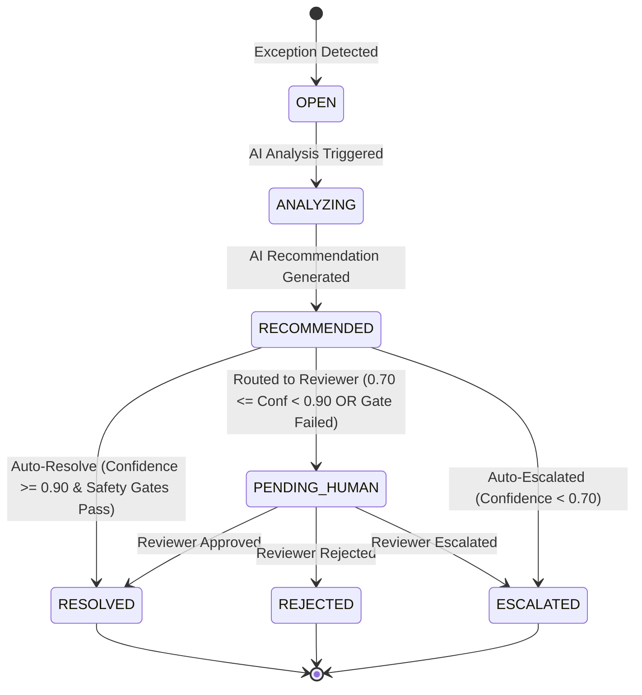

# Data Model & Schema Specification

**Feature**: Real-Time Exception Resolution Workbench
**Branch**: `001-exception-resolution-workbench`
**Date**: 2026-08-21

---

## 1. Domain Enums

### ExceptionType
- `AMOUNT_MISMATCH`: Expected amount does not match actual amount within configured tolerance.
- `QUANTITY_MISMATCH`: Expected purchase/received quantity does not match billed quantity.
- `PAYMENT_OVERDUE`: Payment reference date exceeds invoice due date.

### Severity
- `LOW`: Minor discrepancy within low operational risk.
- `MEDIUM`: Moderate discrepancy requiring standard verification.
- `HIGH`: Severe discrepancy (>15% variance, >30 days overdue, or missing critical evidence).

### ExceptionStatus
- `OPEN`: Detected and awaiting analysis.
- `ANALYZING`: AI explanation or suggested resolution in progress.
- `RECOMMENDED`: AI suggestion generated with confidence score.
- `PENDING_HUMAN`: Routed for mandatory human review (confidence 70%-89% or safety gate blocked).
- `RESOLVED`: Successfully resolved (either autonomously by system or approved by reviewer).
- `ESCALATED`: Escalated for senior management/investigation (confidence < 70% or manual escalation).
- `REJECTED`: Reviewer rejected exception/discrepancy.

### AllowedAction
- `REQUEST_VENDOR_CORRECTION`: Notify vendor to reissue invoice/credit memo.
- `REQUEST_PAYMENT_REVIEW`: Route to treasury/accounts payable for payment terms verification.
- `REQUEST_QUANTITY_REVIEW`: Route to warehouse/receiving team for physical goods check.
- `APPROVE_EXCEPTION`: Conclude discrepancy is acceptable business variance and approve.
- `ESCALATE_TO_HUMAN`: Refer to senior operations lead.
- `NO_ACTION`: Logged without operational adjustment.

### ActorType
- `SYSTEM`: Automated background engine / deterministic rules.
- `AI_EMPLOYEE`: LLM inference engine.
- `HUMAN_REVIEWER`: Authorized human operations specialist.

---

## 2. Core Entities & Relational Schema

### 2.1 Transaction (`transactions`)
Represents an enterprise financial/inventory transaction.

| Field | Type | Nullable | Description |
|---|---|---|---|
| `id` | String (PK) | No | Unique transaction ID (e.g. `TXN-1001`) |
| `reference_number` | String | No | External reference (e.g. `INV-1023`, `PO-8872`) |
| `transaction_type` | String | No | Type of transaction (e.g. `INVOICE`, `PURCHASE_ORDER`) |
| `vendor` | String | No | Counterparty/Vendor name |
| `expected_amount` | Float | Yes | Expected contract/PO amount in INR |
| `actual_amount` | Float | Yes | Invoiced/Actual billed amount in INR |
| `expected_quantity`| Integer | Yes | Expected PO line quantity |
| `actual_quantity` | Integer | Yes | Delivered/Billed quantity |
| `due_date` | Date/String | Yes | Payment due date (`YYYY-MM-DD`) |
| `reference_date` | Date/String | Yes | Evaluation reference date (`YYYY-MM-DD`) |
| `currency` | String | No | ISO Currency code (default `INR`) |
| `metadata_json` | JSON/Text | Yes | Raw enterprise payload |
| `created_at` | DateTime | No | Creation timestamp (UTC) |

### 2.2 Exception (`exceptions`)
Represents a deterministic discrepancy flagged against a transaction.

| Field | Type | Nullable | Description |
|---|---|---|---|
| `id` | String (PK) | No | Unique exception ID (e.g. `EXC-1001`) |
| `transaction_id` | String (FK) | No | References `transactions.id` |
| `type` | Enum | No | `AMOUNT_MISMATCH`, `QUANTITY_MISMATCH`, `PAYMENT_OVERDUE` |
| `severity` | Enum | No | `LOW`, `MEDIUM`, `HIGH` |
| `status` | Enum | No | Current `ExceptionStatus` |
| `title` | String | No | Human-readable summary |
| `description` | Text | No | Detailed explanation of discrepancy |
| `expected_value` | String | Yes | Formatted expected value |
| `actual_value` | String | Yes | Formatted actual value |
| `difference` | String | Yes | Absolute variance / diff value |
| `threshold` | String | Yes | Configured threshold benchmark |
| `evidence_json` | JSON/Text | No | Structured evidence fields |
| `created_at` | DateTime | No | Timestamp when exception was detected |
| `updated_at` | DateTime | No | Timestamp of latest state change |
| `resolved_at` | DateTime | Yes | Timestamp of final resolution |

### 2.3 Evidence Model (`evidence_json`)
Structured payload attached to each exception:
```json
{
  "fields": [
    {
      "name": "invoice.amount",
      "value": 62500,
      "source": "invoice",
      "label": "Invoice Amount"
    },
    {
      "name": "purchase_order.amount",
      "value": 50000,
      "source": "purchase_order",
      "label": "PO Amount"
    },
    {
      "name": "variance",
      "value": 0.25,
      "source": "exception_engine",
      "label": "Calculated Variance"
    },
    {
      "name": "allowed_variance",
      "value": 0.10,
      "source": "policy",
      "label": "Allowed Policy Tolerance"
    }
  ],
  "completeness_score": 1.0
}
```

### 2.4 Resolution (`resolutions`)
Represents a proposed or committed resolution.

| Field | Type | Nullable | Description |
|---|---|---|---|
| `id` | String (PK) | No | Unique resolution ID (e.g. `RES-1001`) |
| `exception_id` | String (FK) | No | References `exceptions.id` |
| `suggested_action` | Enum | No | Allowed action from enum |
| `reason` | Text | No | Rationale backing the resolution |
| `confidence` | Float | No | Composite confidence score (0.0 to 1.0) |
| `score_breakdown` | JSON/Text | No | Breakdown (evidence, rule, classification, AI) |
| `safety_gates_passed`| Boolean | No | True if all deterministic gates pass |
| `execution_mode` | String | No | `AUTO` or `MANUAL` |
| `executed_by` | Enum | No | `SYSTEM` or `HUMAN_REVIEWER` |
| `created_at` | DateTime | No | Timestamp when suggestion was created |

### 2.5 AuditEvent (`audit_events`)
Immutable audit log entry for regulatory and operational tracking.

| Field | Type | Nullable | Description |
|---|---|---|---|
| `id` | String (PK) | No | Unique audit log ID (e.g. `AUD-1001`) |
| `exception_id` | String (FK) | No | References `exceptions.id` |
| `actor` | Enum | No | `SYSTEM`, `AI_EMPLOYEE`, `HUMAN_REVIEWER` |
| `action` | String | No | E.g. `EXCEPTION_CREATED`, `AI_RECOMMENDATION_GENERATED`, `AUTO_RESOLVED`, `HUMAN_APPROVED` |
| `reason` | Text | Yes | Explanation or human note |
| `metadata_json` | JSON/Text | Yes | Snapshot of relevant fields, confidence, latencies |
| `timestamp` | DateTime | No | UTC timestamp |

---

## 3. Lifecycle State Transitions


